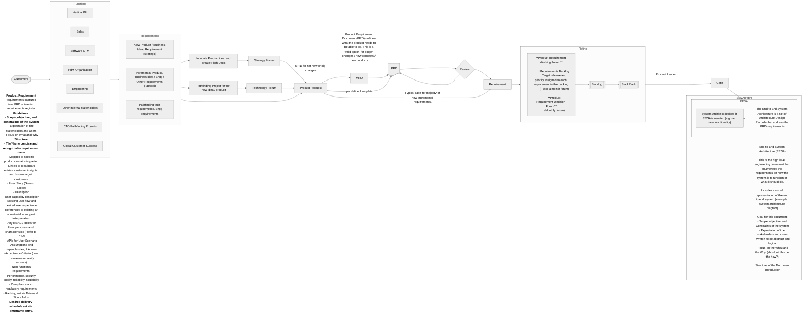

```mermaid
---
config:
      theme: neutral
      flowchart:
        curve: basis
---
flowchart LR  
    A(["Customers"])
    subgraph Functions
        direction RL
        vBU["Vertical BU"]
        Sales
        sGTM["Software GTM"]
        PdM["PdM Organization"]
        Eng["Engineering"]
        Stakeholders["Other internal stakeholders"]
        CTO["CTO Pathfinding Projects"]
        GCS["Global Customer Success"]
    end

    A --> Functions

    subgraph Requirements
        direction RL
        New["New Product / Business Idea / Requirement (strategic)"]
        Incr["Incremental Product / Business idea / Engg / Other Requirements (Tactical)"]
        Pathfinding["Pathfinding tech requirements, Engg requirements"]
    end

    Functions --> Requirements

    Incubate["Incubate Product idea and create Pitch Deck"]
    StrategyForum["Strategy Forum"]
    PathfindingProject["Pathfinding Project for net new idea / product"]
    TechForum["Technology Forum"]

    Requirements --> Incubate --> StrategyForum --> ProdReq
    Requirements --> ProdReq
    Requirements --> PathfindingProject --> TechForum --> ProdReq

    PRD@{ shape: document, label:"Product Requirements Document (PRD)"}
    PRDdesc@{ shape: text, label: "Product Requirement Document (PRD) outlines what the product needs to be able to do. This is a valid option for bigger changes / new concepts / new products" }
    MRDdesc@{ shape: text, label: "MRD for net new or big changes"}
    PRDdesc ~~~ PRD
    ProdReq --> MRD --> PRD
    MRDdesc ~~~ MRD                 
    ProdReq -- "per defined template" --> PRD

    PRD --> Review@{ shape: decision, label: "Review" }
    Review --> Requirement
    Review ---> PRD

    ProdReq["Product Request"]

    ReqDesc@{ shape: text, label: "**Product Requirement**
    Requirements captured into PRD or interim requirements register
    **Guidelines:**
    - **Scope, objective, and constraints of the system**
    - Expectation of the stakeholders and users
    - Focus on What and Why
    
    **Structure**
    - **Tile/Name concise and recognizable requirement name**
    - Mapped to specific product domains impacted
    - Linked to Idea board entries, customer insights and known target customers
    - User Story (Goals / Scope)
    - Description
      - User capability description
      - Existing user flow and desired user experience
      - References to existing art or material to support interpretation
      - Any RBAC / Roles for User persona's and characteristics (Refer to PRD)
      - APIs for User Scenario
      - Assumptions and dependencies, if known
    - Acceptance Criteria (how to measure or verify success)
    - Non-functional requirements
      - Performance, security, quality, reliability, scalability
      - Compliance and regulatory requirements
    - Ranking set via Drivers & Score fields
    
    **Desired delivery schedule set via timeframe entry.**"}

    ProdReq -- "Typical case for majority of new incremental requirements." --> Requirement

    subgraph Refine
        direction LR
        ProdForum["**Product Requirement Working Forum**
        
        Requirements Backlog
        Target release and priority assigned to each requirement in the backlog
        (Twice a month forum)
        
        **Product Requirement Decision Forum**
        (Monthly forum)"]
        Backlog@{ shape: subproc }
        StackRank@{ shape: subproc }
        ProdForum --> Backlog --> StackRank
    end

    Requirement --> Refine
    PL@{ shape: text, label: "Product Leader"}
    Gate
    PL ~~~ Gate
    Refine ---> Gate

    subgraph EESA
        direction LR
        EESAp["System Architect decides if EESA is needed (e.g. net new functionality)"]
        EESAdesc@{ shape: text, label:"The End to End System Architecture is a set of Architecture Design Records that address the PRD requirements."}
    end
    Gate --> EESA

    subgraph EESAgraph
        direction LR
        EESAp["System Architect decides if EESA is needed (e.g. net new functionality)"]
        EESAdesc@{shape: text, label: "The End to End System Architecture is a set of Architecture Design Records that address the PRD requirements"}
        EESA["End to End System Architecture"]
        EESAdoc@{ shape: text, label: "End to End System Architecture (EESA)<br>
        This is the high level engineering document that enumerates the requirements on how the system is to function or what it should do.<br>
        Includes a visual representation of the end to end system (example: system architecture diagram)<br>
        Goal for this document:
        - Scope, objective and Constraints of the system
        - Expectation of the stakeholders and users
        - Written to be abstract and logical
        - Focus on the What and the Why (shouldn't this be the how?)<br>
        Structure of the Document
        - Introduction "}
        EESAp --> EESA
    end

```
